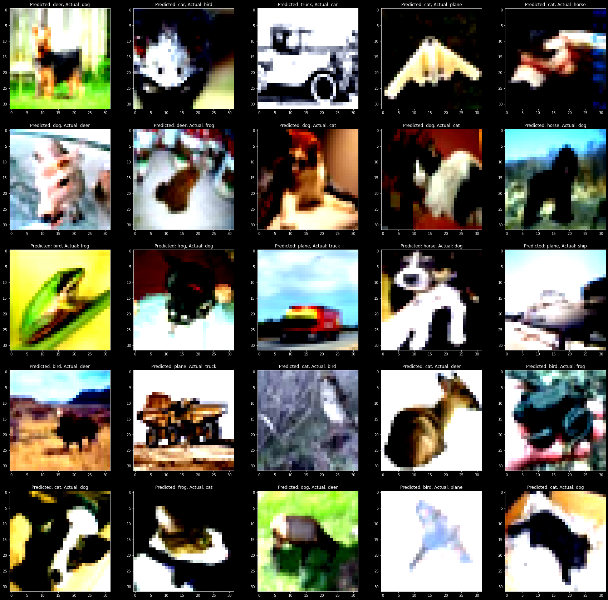

# Assignment - 9
> Submitted by Naman Shrimali
---

## Target
* Move your last code's transformations to Albumentations. Apply ToTensor, HorizontalFlip, Normalize (at min) + More (for additional points)
* Please make sure that your test_transforms are simple and only using ToTensor and Normalize
* Implement GradCam function as a module. 
* Your final code (notebook file) must use imported functions to implement transformations and GradCam functionality
* Target Accuracy is 87%


## Submission
I have trained the model and summary, graphs, gradcam reports, observations and details can be found below. I've made a seperate library - [simplif-ai](https://github.com/namanshrimali/simplif-ai) (pronounced simplifai, or simplify) -  for the boilerplate codes that can be used effectively everywhere !

## Results 
* No of parameters: `11,173,962`
* No of epochs: `50`
* Droupout: `10%`
* First training accuracy: 22.3060%
* First validation accuracy: 35.62%%
* Highest training accuracy: **90.7100%** (Epoch 48)
* Highest validation accuracy: **89.44%** (Epoch 49) 
* The validation accuracy settled around `89.30%` in the final epochs
---

### Model
```
================================================================
Model: Resnet-18
Total params: 11,173,962
Trainable params: 11,173,962
Non-trainable params: 0
----------------------------------------------------------------
Input size (MB): 0.01
Forward/backward pass size (MB): 15.44
Params size (MB): 42.63
Estimated Total Size (MB): 58.07
----------------------------------------------------------------
```
---

## Observations
* Model is slightly overfitting, and the training and the validationa accuracies differ in decimals (which is a good thing I guess ?) 
* Learning rate of 0.2, with a scheduler introduced with gamma of 0.5 and step size of 8 was introduced
* I've used **albumentations** as the library for adding augumentations. Below are the lists of augumentations I've experimented with and the results I got after using those combinations
    * with cutout -> 81% validation accuracy (For 35 epochs)
    * with cutout + 10% dropout -> 83% validation accuracy (For 35 epochs)
    * with cutout + 10% dropout + ChannelDropout -> 86.51% train accuracy, 81.02% validation accuracy
    * with cutout + 10% dropout + ChannelDropout + Blur -> 84.2800% train accuracy, 78.79% validation accuracy
    * with cutout + 10% dropout + ChannelDropout + GridDistortion -> 88.8620% train accuracy, 86.46% validation accuracy (Ran for 35 epochs, It had potential !!)
    * with cutout + 10% dropout + ChannelDropout + GridDistortion + GaussNoise -> 88.1380% train accuracy, 84.85% validation accuracy (Ran for 40 epochs)
    * with cutout + 10% dropout + ChannelDropout + GridDistortion + ElasticTransform -> 68.2120% train accuracy, 80.74% validation accuracy (Ran for 35 epochs)
    * with cutout + 10% dropout + ChannelDropout + GridDistortion + RandomCrop -> 86.9360% train accuracy, 87.75% validation accuracy (Ran for 40 epochs)
    *  **with cutout + 10% dropout + ChannelDropout + GridDistortion + RandomCrop + HorizontalFlip -> 90.7100% train accuracy, 89.44% validation accuracy (Ran for 50 epochs)**
* Implemented **GradCam** as a module and visualized where the model is actually focussing on while performing object recognition, and findings were pretty interesting (ps, the model was absolutely hopeless when ran for `0 epochs` xD)
## Future Aspirations
* Will explore more techniques over how to get 90% accuracy
* Need to explore more optimizers that are fit for cifar-10 dataset
* Low performance for dog (76%) and cat (80%) images might be because I accidently damaged the data for these classes while aggressively augumenting things, will carefully examine the affects of various augumentations over these images

## Visual Analysis

### Misclassified Images


### GradCam generated reports

