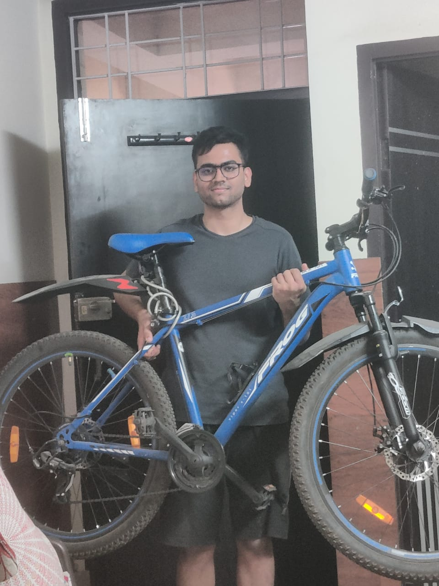
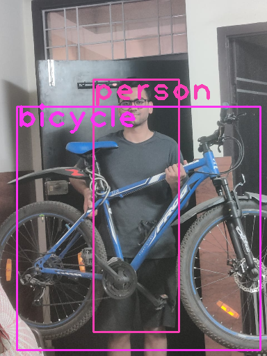

# Assignment - 13 - YoLo
> Submitted by Naman Shrimali
---

## Target

* OpenCV Yolo: SOURCE
    * Run this above code on your laptop or Colab. 
    * Take an image of yourself, holding another object which is there in COCO data set (search for COCO classes to learn). 
    * Run this image through the code above. 
    * Upload the link to GitHub implementation of this
    * Upload the annotated image by YOLO. 

* Share your NEWLY annotated (same as 12, but annotated using new tool) images with Zoheb by Wednesday at midnight. Take the set back for training on Thursday.
* Training Custom Dataset on Colab for YoloV3
    * Refer to this Colab File: LINK
    * Refer to this GitHub Repo
    * Collect a dataset from the last assignment and re-annotate them. Steps are explained in the readme.md file on GitHub.
* Once done:
    * Download a very small (~10-30sec) video from youtube which shows your classes. 
    * Use ffmpeg to extract frames from the video. 
    * Upload on your drive (alternatively you could be doing all of this on your drive to save upload time)
    * Infer on these images using detect.py file. **Modify** detect.py file if your file names do not match the ones mentioned on GitHub. 
    ```
    python detect.py --conf-thres 0.3 --output output_folder_name
    ```
    * Use ffmpeg  to convert the files in your output folder to video
    * Upload the video to YouTube. 
* Share the link to your GitHub project with the steps as mentioned above
* Share the link to your YouTube video
* Share the link of your YouTube video on LinkedIn, Instagram, etc! You have no idea how much you'd love people complimenting you! 

## Submission
### Yolo with Coco:
 

It's been so long since I want to show off my brand new cycle. A "gear wali cycle" was my childhood dream.

---

### Training Custom Dataset for YoloV3
* It took so long to train this thing 😭
* Added logic to save trained model on colab after every epoch. The logic saved so many days of training
* Results can be found [here](https://www.linkedin.com/feed/update/urn:li:activity:6781471366773293056/). Do like and comment. I'm hungry for external validation

### Some more stuffs
I kind of forgot to add annotated images & labels into the zip that I uploaded (I worked so hard to annotate them 😭). I wanted to train my model with my images in them too, so I created my very own script to make the dataset (coco style). You can have a look at that [here](data_collect.ipynb)