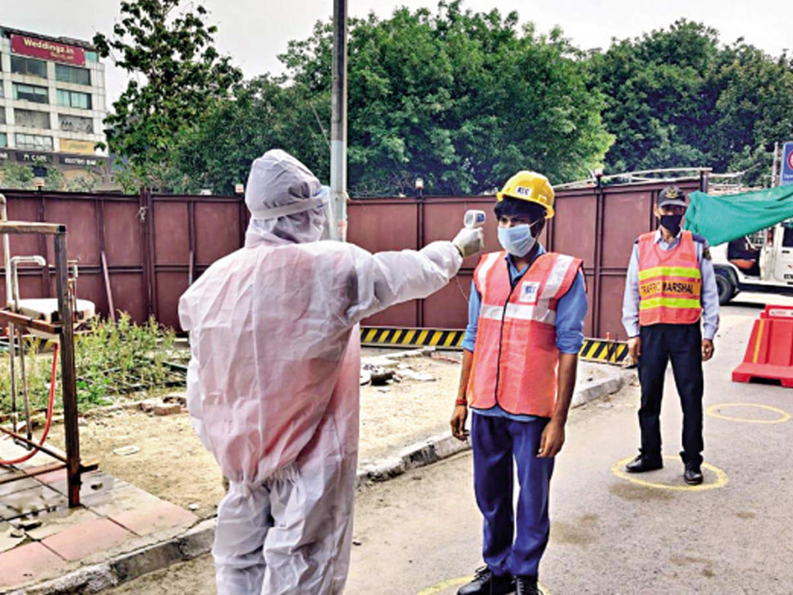
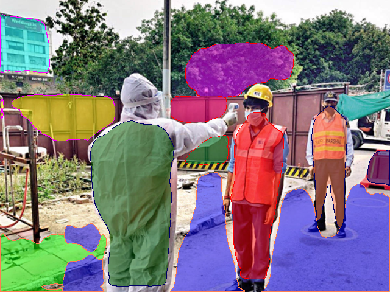

# Assignment - 15 - MiDaS & PlanerCNN
> Submitted by Naman Shrimali
---

## Target - Assignment 15A

* Look at this [model](https://github.com/intel-isl/MiDaS)
* Look at this [model](https://github.com/NVlabs/planercnn)
* Now you have your helmet, mask, PPE, and boots dataset as well
* Take your dataset and run it through Midas and get depth images.
* Take your dataset and run it through the PlanerCNN model and get planer images (you'll not be using the depth images from PlanerCNN, so don't store them). 
* Now your dataset contains depth map, surface planes, and bounding boxes for the classes
* Upload to your google drive with a shareable link to everyone, and add a GitHub repo that describes the dataset properly.

## Observations
* The base code for planer-cnn code was working on outdated libraries/versions, whose support has been officially dropped by colab. After trial & error, found this to be working:
    * torch v0.4.1.post2
    * gcc v5
    * numpy v1.16
    * cuda v8.0
* Intel MiDaS ran perfectly fine (:

## Results

Input image

 Depth mask from Intel MiDaS
 
 

Segmentation mask from PlanerCNN 
