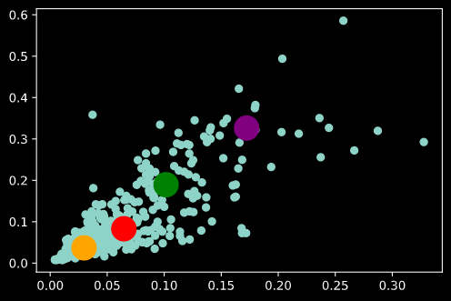

# Assignment - 12
> Submitted by Naman Shrimali
---

## Target
* Assignment A:
    * Download this [TINY IMAGENET](http://cs231n.stanford.edu/tiny-imagenet-200.zip) dataset. 
    * Train ResNet18 on this dataset (70/30 split) for 50 Epochs. Target 50%+ Validation Accuracy. 
    * Submit Results. Of course, you are using your own package for everything. You can look at this  for reference. 
* Assignment B:
    * Download 50 (min) images each of people wearing hardhat, vest, mask and boots. 
    * Use these labels (same spelling and small letters):
        * hardhat
        * vest
        * mask
        * boots
    * Use [this](https://towardsdatascience.com/machine-learning-algorithms-part-9-k-means-example-in-python-f2ad05ed5203) to annotate bounding boxes around the hardhat, vest, mask and boots.
    * Download JSON file. 
    * Describe the contents of this JSON file in FULL details (you don't need to describe all 10 instances, anyone would work). 
    * Refer to this [tutorial](https://towardsdatascience.com/machine-learning-algorithms-part-9-k-means-example-in-python-f2ad05ed5203) . Find out the best total numbers of clusters. Upload link to your Colab File uploaded to GitHub. 

## Submission
---
### Assignment A:
I have trained the model for 50 epochs, with optimal leraning rate (calculated through lr finder) of **2.22E-01** and summary, graphs, gradcam reports for misclassified images, observations and details can be found below. I've made a seperate library - [simplif-ai](https://github.com/namanshrimali/simplif-ai) (pronounced simplifai, or simplify) -  for the boilerplate codes that can be used effectively everywhere !

#### Results 
* No of parameters: 11,173,962
* No of epochs: `50`
* Droupout: 0%
* First training accuracy: 3.5229%
* First validation accuracy: 5.31%
* Highest training accuracy: 96.8986%
* **Highest validation accuracy: 54.87%**
* The validation accuracy settled around 54.5% in the final epochs


#### Model
```
================================================================
Model: Resnet-18
Total params: 11,173,962
Trainable params: 11,173,962
Non-trainable params: 0
----------------------------------------------------------------
Input size (MB): 0.01
Forward/backward pass size (MB): 15.44
Params size (MB): 42.63
Estimated Total Size (MB): 58.07
----------------------------------------------------------------
```
---

#### Observations
* Model is highly overfitting & takes a lot of time to train (roughly 5 hours on google colab) 
* The maximum learning rate was determined by optimal lr finder, which ran for 300 iterations and returned an optimal lr of 2.22E-01

* Implemented OneCycleLR with following parameters:
    * Epochs: 50
    * Max at epoch: 10
    * Steps per Epochs: len(trainloader) = 98
    * Total steps : Epochs * Steps per epoch = 2352
    * pct_start: max_at_epoch/total_epochs = 10/50
    * Division factor: 8
    * Final division factor: 1 (No annihlation)

### Assignment B
* Created a dataset of in total of around 37 images, with total bounding boxes of each class is as follows:
```
boots      147
hardhat    146
vest       115
mask        93
Name: class, dtype: int64
```
* The json file of the dataset can be found [here](dataset/Construction_PPE_Dataset.json)
* The labelled images can be found [here](dataset/images/)
* Implemented k-means cluster algorithm and found an elbow at 4 clusters

* Visualization for clusters:


### Misclassified Images and their gradcam reports


## Future Aspirations
> I want to become a pilot !
